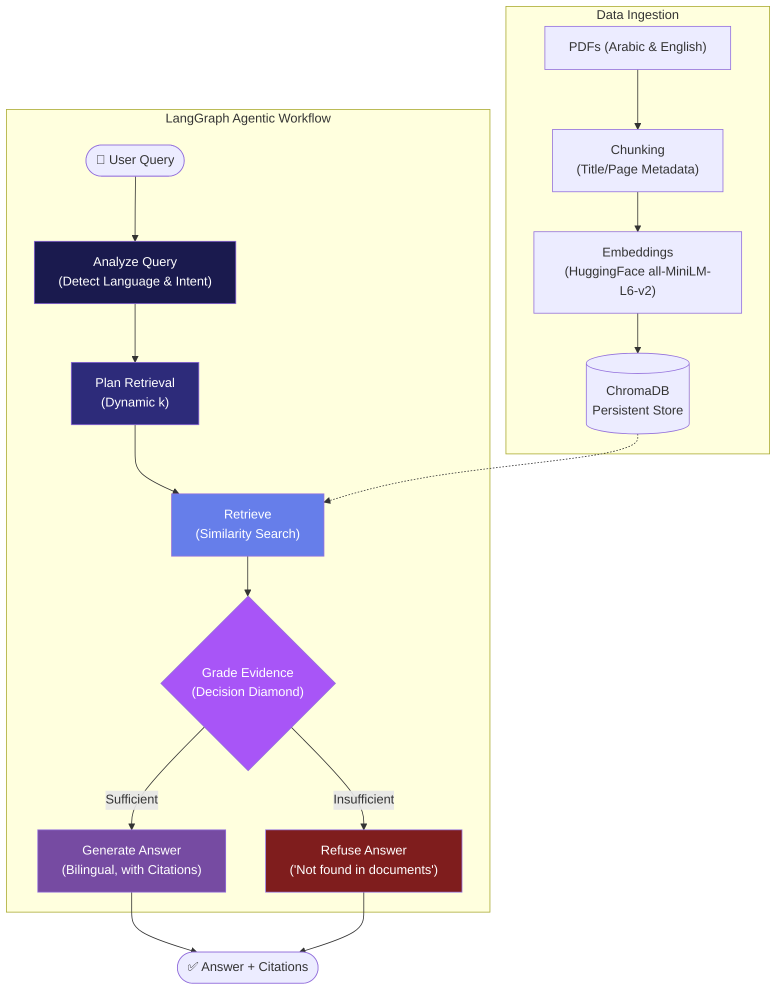

# AI for Palestine Smart Library - Final Presentation

## Slide 1: Architecture Type

**Agentic RAG**

- **Standard RAG vs. Agentic RAG**: Standard RAG pipelines blindly pass retrieved context to the LLM, leading to a high risk of hallucination if the retrieval is poor. Our architecture uses an Agentic RAG approach powered by LangGraph.
- **The "Grade Evidence" Node**: We introduced a critical LLM-as-judge step before generation. This node rapidly evaluates each retrieved chunk for relevance to the user's question.
- **Avoiding the -20 Point Penalty**: If no chunks pass the grading step, the agent actively aborts generation and routes to a deterministic "Fallback" node. This ensures the system replies exactly with "not found in documents," completely avoiding the severe hallucination penalty by strictly verifying data before attempting an answer.

---

## Slide 2: Architecture Diagram

---

## Slide 3: Architecture Explanation

- **Language Detection Routing:** The first agent node analyzes the query. If it contains >15% Arabic characters, it dynamically routes the entire generation pipeline and prompts to reply strictly in Arabic. It also classifies the intent (factual/analytical) to adjust the retrieval size `k`.
- **Retrieval Logic from ChromaDB:** Based on the query plan, the system queries the local ChromaDB vector store using HuggingFace sentence-transformers. Analytical/comparative queries dynamically append context keywords (like "history," "cause") to improve vector recall.
- **The Agent's Decision-Making (Grading):** A fast LLM call scores each retrieved chunk (1 for relevant, 0 for irrelevant). The agent drops irrelevant chunks to reduce noise. If the final filtered context is empty, the agent refuses to answer.
- **Forcing Exact Citations:** During the PDF ingestion phase, we strictly attach `document_title` and `page_number` to every chunk's metadata. The final Generation node prompt explicitly injects this metadata and forces the rule: "Every answer MUST end with the citation: (Source: [Title], Page: [Page Number])."

---

## Slide 4: Technical Challenges & Specific Solutions

- **Challenge 1: The "Secret PDF Test"**
  - _Problem:_ Injecting a brand-new PDF into the active vector store securely without restarting the Streamlit app or mixing it with the 15 baseline documents.
  - _Solution:_ We built a live ingestion pipeline (`pdfplumber` with `PyPDFLoader` fallback) that chunks and batches vectors (size 200) straight into the active ChromaDB instance. To prevent the "Grade Evidence" node from rejecting this unseen document, we implemented a dedicated router (`run_rag_on_document`) that uses ChromaDB metadata filters (`where={"document_title": ...}`) to securely restrict the context to _only_ the new PDF.
- **Challenge 2: Enforcing Strict Citations & Zero-Hallucination**
  - _Problem:_ LLMs tend to answer from their pre-trained weights when the context is missing, violating the strict competition rules.
  - _Solution:_ We solved this using a dual-layer defense. First, the LangGraph conditional routing completely bypasses the LLM generation node if the context isn't highly relevant. Second, the system prompt contains aggressive constraints ("Answer ONLY from context," "If not found: reply EXACTLY: 'not found'").

---

## Slide 5: Innovation & Bonus Features

- **Voice STT/TTS:** Integrated **Groq Whisper** for lightning-fast, auto-detecting Arabic/English speech-to-text, and **gTTS** to read bilingual answers out loud.
- **Multi-Model Comparison:** Built a live toggle to run side-by-side, real-time comparisons of **Llama-3 (8B)** and **Mixtral (8x7B)** using Groq APIs.
- **One-Click Translation:** A dedicated AI Grid translation button dynamically translates any assistant response or historical chat message between Arabic and English.
- **JSON Export:** Implemented a one-click sidebar utility to download the entire structured chat history as a JSON file.
- **Advanced Analytics Dashboard:** Designed a dynamic Plotly dashboard featuring query sentiment progression (line charts), corpus entity frequency (horizontal bars), and interactive vector cosine similarity (heatmaps).

---

**GitHub Repository:** [https://github.com/maicro24/palestine_chatbot](https://github.com/maicro24/palestine_chatbot)
**HuggingFace Link:** [https://huggingface.co/spaces/okjlkli/palestine_chatboot/tree/main](https://huggingface.co/spaces/okjlkli/palestine_chatboot/tree/main)
**Live Streamlit App:** [https://palestinechatbot-lc3kf4mx5rav8r8corjmdi.streamlit.app/](https://palestinechatbot-lc3kf4mx5rav8r8corjmdi.streamlit.app/)
